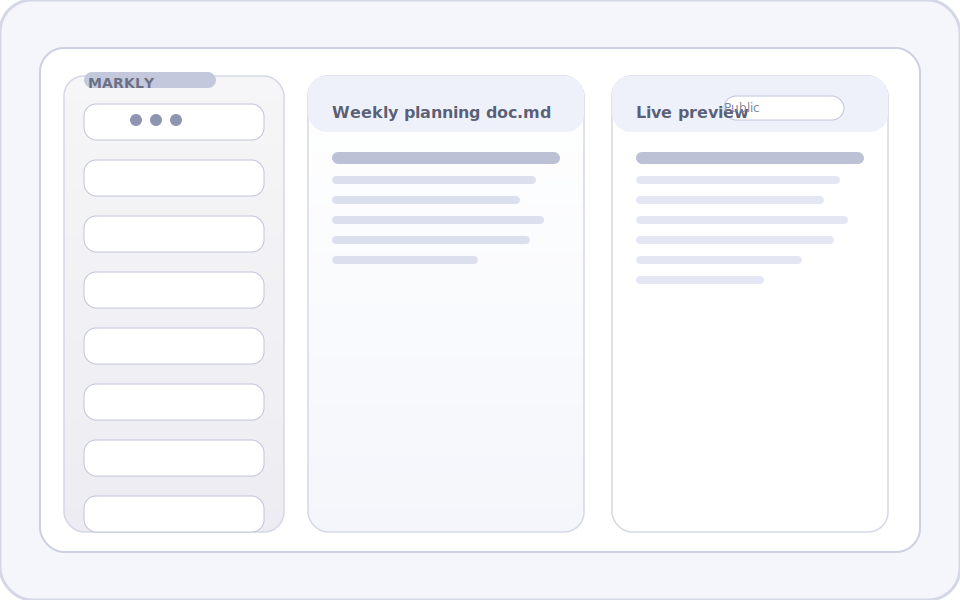
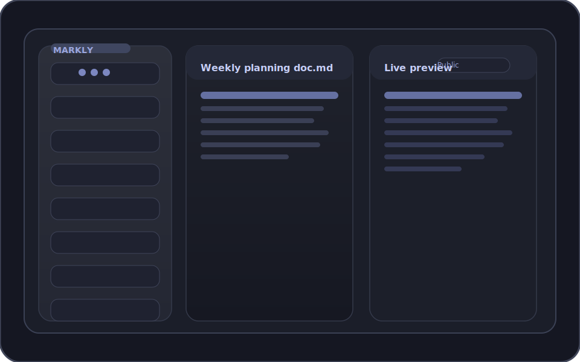

# Markly – Offline-First Markdown Knowledge Hub

**Stack:** PHP 8 · MySQL 8 · Vanilla JS · IndexedDB · PWA · OKLCH design tokens · InfinityFree hosting

**Key Features:** Offline-first notes, CSRF-secured CRUD API, responsive drawer UI, search + tags, live Markdown preview, optimistic sync

**Demo Login:** `admin@example.com` / `admin123`

**Live Demo:** [minischetti.infinityfreeapp.com](https://minischetti.infinityfreeapp.com/)

> A recruiter-friendly showcase project: a login-protected, offline-capable Markdown notebook built with pure PHP, MySQL, and vanilla web tech — deployable as-is on InfinityFree.

## Preview

Light mode:



Dark mode:



## 🚀 Live Demo

[](https://minischetti.infinityfreeapp.com/)

[https://minischetti.infinityfreeapp.com/](https://minischetti.infinityfreeapp.com/)

## 🎞️ Animated Walkthrough


The SVG above animates the core loop — drafting a note, going offline, and watching the outbox sync once connectivity resumes (keeps the repo binary-free).

## Feature highlights

- 🔐 **Secure auth** – Email/password login with hardened PHP sessions, SameSite cookies, CSRF tokens, and ID regeneration.
- 📝 **Full Markdown workspace** – Keep the bundled Markly editor, keyboard shortcuts, live preview toggle, and sticky metadata bar.
- 🏷️ **Smart organisation** – Search (FULLTEXT when available, LIKE fallback), tag chips, backlink stubs, and optional graph data endpoint.
- 📶 **Resilient offline mode** – Service worker app-shell cache, IndexedDB storage, request outbox with replay + conflict detection, and clear sync toasts.
- 🌗 **Polished theming** – OKLCH-driven light/dark palettes, outlined/sticker UI accents, and fluid transitions tailored for mobile drawers and desktop split panes.
- ☁️ **InfinityFree ready** – Only GET/POST verbs, PDO prepared statements, relative asset paths, and `.htaccess` headers for `sw.js` + `manifest.webmanifest`.

## 🔒 Security practices implemented

- CSRF protection on every state-changing endpoint (`Markly\Csrf` + rotating tokens).
- Session hardening with secure cookie flags, configurable regeneration cadence, and demo-mode overrides to keep live creds stable.
- XSS sanitisation via DOMPurify in the embedded Markly markdown preview.
- Database access through PDO prepared statements only (strict error mode, no string interpolation).

## 🧩 Built With

| Layer | Stack |
| --- | --- |
| Backend runtime | PHP 8, InfinityFree-friendly deployment (no Composer) |
| Data store | MySQL 5.x compatible schema with FULLTEXT fallback |
| Domain services | Plain PHP classes in `/htdocs/src/` (Auth, NotesRepo, Csrf, TextUtil, LinksRepo) |
| Front-end | Vanilla JS modules (`app.js`, `api.js`, `db.js`, `editor.js`), Markly editor component |
| Offline shell | Service worker + IndexedDB outbox + responsive OKLCH-themed UI |

## 🔍 Recruiter Quick View

- **10-second pitch:** Offline-capable Markdown workspace, built from scratch with PHP, MySQL, and vanilla JS — no frameworks or build steps.
- **Demo account:** `admin@example.com` / `admin123` (sessions stay active thanks to demo-mode session config).
- **Docs to skim:** [Architecture overview](htdocs/docs/architecture.md) · [Changelog](CHANGELOG.md)

## 🛠 How It Works Internally

**Backend** – `/htdocs/index.php` handles routing, boots secure sessions, and passes Markly constants into the SPA. Domain classes in `/htdocs/src/` wrap authentication, text utilities, CSRF, and notes/backlink persistence with optimistic locking.

**API layer** – `/htdocs/api/*.php` endpoints validate CSRF tokens, call repositories, and respond through `Markly\Response::json()` (exit-after-output, cache disabled). All SQL uses bound parameters, and ETags power optimistic concurrency.

**Frontend** – Vanilla modules under `/htdocs/assets/js/` coordinate the UI: `app.js` wires keyboard shortcuts, syncing toasts, and the drawer layout; `api.js` centralises fetch + CSRF + ETag handling; `editor.js` bridges the Markly component to toolbar actions; `graph.js` exposes backlinks stubs.

**Offline loop** – `db.js` namespaced with `mdpro_` prefixes manages IndexedDB caches and an outbox that deduplicates queued mutations. `sw.js` (versioned `v1.2.0`) precaches the shell, runs network-first for APIs, and logs activation for debugging.

## Getting started

### 1. Create the database

1. Create a MySQL database with collation `utf8mb4_unicode_ci`.
2. Import `htdocs/sql/schema.sql` to create tables, foreign keys, and the FULLTEXT index.
3. Import `htdocs/sql/seed.sql` for the demo account plus sample notes and tags.

### 2. Configure the app

1. Copy `htdocs/config/config.example.php` to `htdocs/config/config.php`.
2. Update the DSN, username, password, and optional `base_url`. Set `debug => true` for local error output, `demo_mode => true` to keep the showcase session alive, and tweak `session_regen_interval` (seconds) for production rotation.
3. Upload the entire `htdocs/` directory (keeping paths intact) to your InfinityFree `htdocs` folder or local web root.
4. Ensure PHP can write to its temp directory — Markly already sets `session_save_path(sys_get_temp_dir());`.

### 3. Local development (XAMPP/MAMP or PHP built-in server)

1. Place the repository where your web server can serve the `htdocs` folder.
2. Start MySQL and import the schema + seed data as above.
3. Launch a local server:
   ```bash
   php -S 127.0.0.1:8000 -t htdocs
   ```
4. Visit `http://127.0.0.1:8000/login.php` and sign in with the demo credentials.

## 🌐 Live Demo Setup (InfinityFree)

1. Upload the `/htdocs` contents via the file manager or FTP.
2. Keep `.htaccess` in place — it enables `Service-Worker-Allowed: /` and serves the manifest with `application/manifest+json`.
3. InfinityFree only supports GET/POST; the client already sends `_method=PUT|DELETE` overrides and the APIs honour them.
4. All URLs are relative (no hard-coded hostnames), so HTTPS offloading via InfinityFree’s proxy Just Works™.
5. Sessions use cookies configured for HTTPS detection through `SERVER_PORT`, `HTTPS`, or `HTTP_X_FORWARDED_PROTO`.
6. After upload, visit `/login.php`, sign in, and confirm the service worker registers under Application → Service Workers in DevTools.

## InfinityFree compatibility checklist

- PDO prepared statements everywhere, strict error modes, and JSON endpoints that exit immediately after `Response::json()`.
- `sw.js` and the web manifest receive proper MIME types and caching rules via `.htaccess`.
- Session cookies: `secure` toggled by runtime HTTPS detection, `httponly`, `SameSite=Lax`, and a shared `session_save_path`.
- Service worker caches the app shell (`index.php`, assets, Markly component) and falls back to network-first for APIs with offline cache fallback.

## Demo credentials

- Email: `admin@example.com`
- Password: `admin123`

Feel free to change the password or add additional users directly in the `users` table.

## Offline & sync workflow

- Notes opened while online are cached in IndexedDB for quick access offline.
- Edits while offline queue into the outbox; when connectivity returns, creates/updates/deletes/publish toggles replay sequentially with conflict detection.
- Toasts announce `Syncing…` and `Synced` states, while the status pill reflects `Queued`, `Saving…`, or `Saved`.
- The service worker precaches the shell and keeps IndexedDB + the API in sync using a network-first strategy with cache fallback.

## ✅ QA Checklist

- [ ] Database created and both `htdocs/sql/schema.sql` + `htdocs/sql/seed.sql` imported.
- [ ] `htdocs/config/config.php` updated with live credentials.
- [ ] `/htdocs` (including `.htaccess`, `manifest.webmanifest`, and `sw.js`) uploaded to the server root.
- [ ] Service worker registered successfully (check browser DevTools → Application → Service Workers).
- [ ] Login with the demo account works and sessions persist across reloads.
- [ ] Create, edit, delete, and publish notes online and offline; queued changes sync after reconnecting.
- [ ] Responsive layout verified on desktop (split view), tablet (sticky tabs), and mobile (drawer sidebar, full-width editor).
- [ ] Public permalink (`/index.php?p=<slug>`) renders the note for unauthenticated visitors.

---

Happy writing, and enjoy showing off an offline-first PHP app that runs on zero build tooling!
